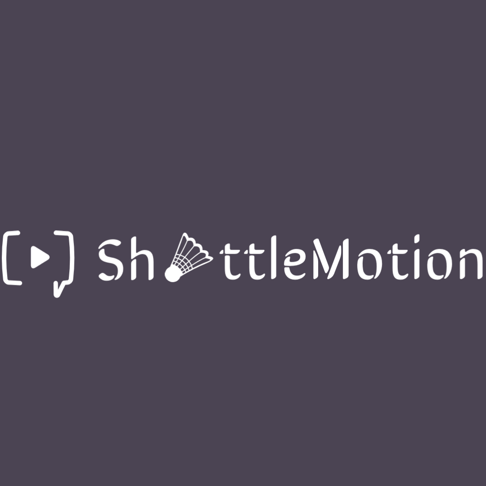

<div align="center">



# Shuttle Motion

[](https://github.com/Maianki/ShuttleMotion-Video-Library/network)
[](https://github.com/Maianki/ShuttleMotion-Video-Library/stargazers)
</div>


---


<!-- TABLE OF CONTENTS -->
<details>
  <summary>Table of Contents</summary>
  <ol>
    <li>
      <a href="#about-shuttle-shopy">About The Project</a>
    </li>
    <li>
      <a href="#getting-started">Getting Started</a>
      <ul>
        <li><a href="#prerequisites">Prerequisites</a></li>
        <li><a href="#installation">Installation</a></li>
      </ul>
    </li>
    <li>
      <a href="#features-and-pages">Features</a>
      <ul>
        <li><a href="#video-listing-page">Video Listing page</a></li>
        <li><a href="#history">History</a></li>
        <li><a href="#like-page">Like Page</a></li>
        <li><a href="#watch-later">Watch Later</a></li>
        <li><a href="#playlist">Playlist</a></li>
        <li><a href="#authentication">Authentication</a></li>
      </ul>
    </li>
  </ol>
</details>

---

## About Shuttle Shopy
Shuttle motion is a video library where you can watch all badminton related videos. From tutorials to match highlights to players interviews. Shuttle motion is built using react, shuttle UI, react-router and mockbee as a mock backend.

---

##  Getting Started
---
### Prerequisites

You need to have `node js` and `react` installed on your local to run this app.

### Installation
Clone the repository on your local machine by typing the below commands on your terminal and cd to `shuttle-motion`.

```
git clone https://github.com/Maianki/ShuttleMotion-Video-Library.git

cd shuttle-motion
```

Install the necessary dependencies.

```
npm install
```

`Shuttle motion` uses `mockbee's` mockbackend. Since, we are working with mock backend servers. We need to give our mock backend access to the JWT secret key. So, for that, go ahead and create a .env file in your root directory of the app and add the below code in it:

```
REACT_APP_JWT_SECRET = <JWT_SECRET_KEY_OF_YOUR_CHOICE>
```

Now to run the app write the following command in your terminal:

```npm start```

This should run the app on localhost:3000.


```
npm start
```

---

## Features and Pages

### Video Listing Page
- User see a video listing page where all the videos are listed.
- User can filter videos based on category selected in video listing page.
- User can add video to a playlist or watch later from video listing page.

### History

- Whenever user watch a video it is added to the history page
- User can remove a specific video or all videos from history page.


### Like page

- User can like a video from a watch page
- User can remove particular video from watch page

### Watch Later

- User can add a video to watch later
- USer can remove a specific video from the Watch Later

### Playlist

- user can create a new playlist
- user can add and remove video from paritcular playlist 
- user can delete exsisting playlist

### Authentication

- User can do a guest login
- User can Log In/Log Out with existing credentials
- User can sign up by if they are new to website

---


## Connect with me on

<a href="https://twitter.com/Ankit_k10"></a>
<a href="https://www.linkedin.com/in/ankit-kumain-4124a21b3/"></a>

## Feedback

If you have any feedback, please reach out to me at [Twitter](https://twitter.com/Ankit_k10)

